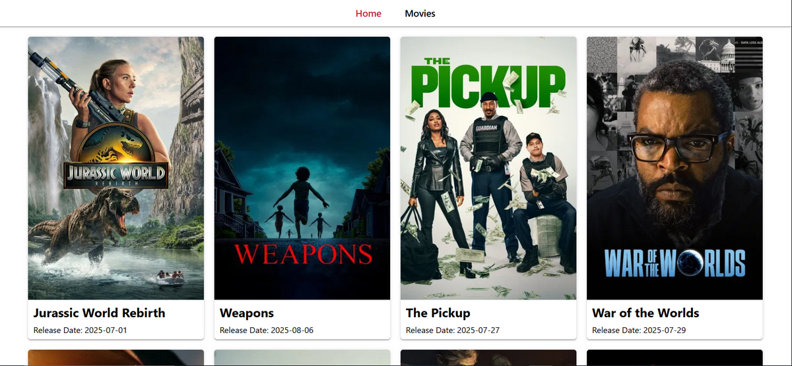

# Film Library – A Convenient Solution for Finding Your Favorite Movies 🎬

🔗 **Live Demo:** [https://goit-react-hw-05-two-omega-84.vercel.app/](https://goit-react-hw-05-two-omega-84.vercel.app/)



## 🔎 Project Description

**Film Library** is a modern web application that helps you find trending or specific movies in just seconds. You can explore what’s popular right now or search for any film by name.

Each movie card provides valuable details: a high-quality poster, overview, genre, release date, cast, and user reviews. With a fast interface and intuitive navigation, **Film Library** is your go-to movie companion.

Perfect for those who love **cinema**, **convenience**, and **quality**.

---

## 🌟 Core Features

- 🔍 **Instant Search**

  - Search by movie title
  - Real-time results without page reload

- 📄 **Detailed Movie Card**
  - High-quality poster
  - Title
  - Overview
  - Genre
  - Release date
  - Cast
  - Reviews

---

## 🧰 Tech Stack

### 🔨 Frontend

- **Vite** – ultra-fast build tool
- **React 18** – UI library
- **React Router DOM v7** – routing
- **Axios** – API requests

### 🎨 UI and UX

- **CSS Modules + modern-normalize** – modular and balanced styles
- **react-hot-toast** – toast notifications
- **react-loader-spinner** – loading indicators
- **clsx** – conditional class application

---

## 🚀 Installation and Launch

### 🔧 Requirements:

- Node.js (latest LTS recommended)
- npm or yarn

### 📦 Installation:

```bash
git clone https://github.com/ConstantineKobushka/film-library
cd film-library
npm install
npm run dev
```
